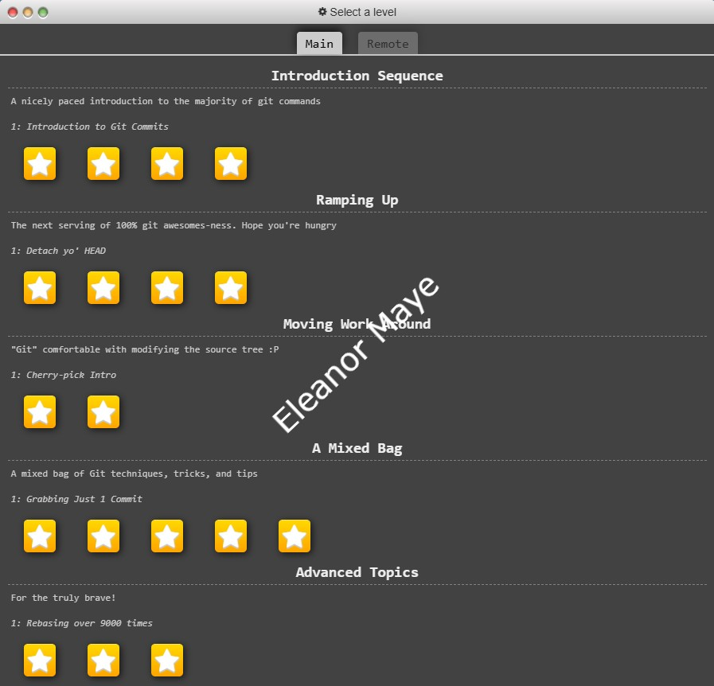

# git-homework2


## 📝 Introduction


```sh
# Stage all changes for commit
git add .


# Commit the staged changes with a message
git commit -m "Add changes"


# Push to the remote repository
git push origin YOUR_BRANCH
```

##### ✅ Task List  


- [ ] Task 1: Complete Git Tutorial 
- [ ] Task 2: Add Screenshots to `README.md`  
- [ ] Task 3: Modify `.html` File  
- [ ] Task 4: Merge latest changes  
- [ ] Task 5: Review pull requests 


This repository is to demonstrate the usage of Git commands for project development.

Eleanor Maye Git Tutorial Screenshots


